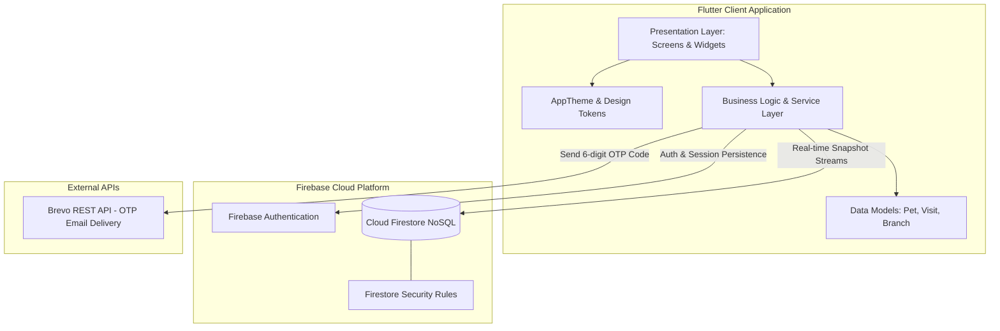
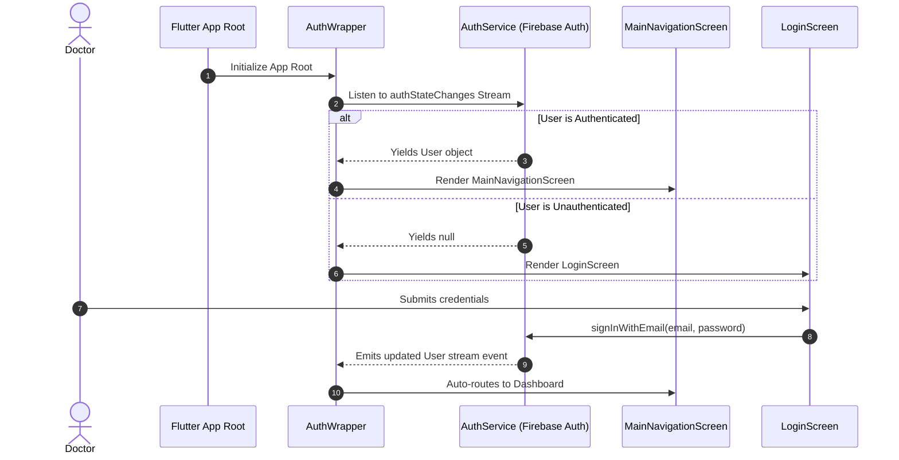
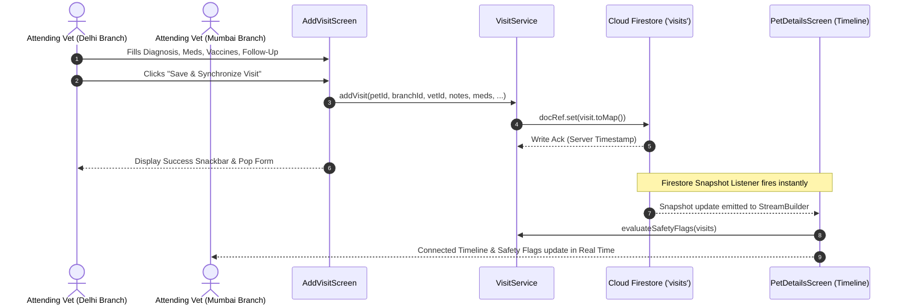
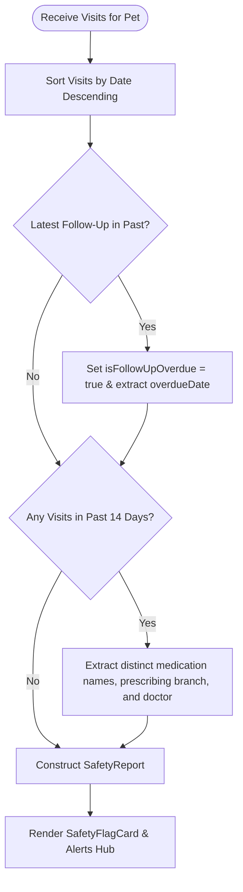

# 🏗️ High-Level Design (HLD) — VetSync

**System:** VetSync Centralized Veterinary Health-Record Platform  
**Document Version:** 2.0  
**Target Architecture:** Flutter Client + Google Firebase Cloud Backend  
**Author:** Nirbhay Jakhar (Team Pioneers)  

---

## 1. Project Overview & Architectural Topology

VetSync is a centralized veterinary health-record mobile application designed for veterinary clinic chains operating across multiple regional branches.

The application follows a clean, reactive Flutter + Firebase architecture, decoupling UI components, business logic services, data models, and cloud persistence.



---

## 2. Architectural Layers

### 2.1 Presentation & UI Layer
- **Workstation Shell (`MainNavigationScreen`):** Manages a 4-tab `IndexedStack` keeping widget state persistent across tab transitions (**Dashboard**, **Patient Directory**, **Safety Alerts Hub**, **Doctor Profile**).
- **Theme & Design System (`lib/theme/`):** Centralizes all color tokens (`AppColors`), typography scales (`AppTextStyles`), elevation styles, button themes, and input decorations in `AppTheme`.
- **Component Library (`lib/widgets/`):** Reusable medical UI components (`ClinicBadge`, `SafetyFlagCard`, `MedicalTimelineTile`, `StatCard`, `EmptyStateView`).

### 2.2 Business Logic & Service Layer (`lib/services/`)
- **`AuthService`:** Manages user registration, email/password authentication, persistent auth streams (`authStateChanges`), session termination, and OTP integration.
- **`PetService`:** Handles patient document creation and real-time streaming (`streamAllPets()`, `streamPetsByBranch()`, `getPetById()`).
- **`VisitService`:** Manages cross-branch visit creation, real-time timeline streaming (`streamVisitsForPet()`), and runs the in-memory **Clinical Safety Flag Engine** (`evaluateSafetyFlags()`).
- **`BranchService`:** Streams clinic locations, provides fallback sync for offline regional clinics, and updates the attending veterinarian's active station in the `vets` Firestore collection.
- **`OtpService`:** Generates cryptographic 6-digit verification codes, handles REST delivery via Brevo with resilient fallback, verifies code validity with TTL expiration, and issues signed reset tokens.

### 2.3 Data Layer & Models (`lib/models/`)
- Strongly-typed Dart data classes (`Pet`, `Visit`, `Branch`, `SafetyReport`, `RecentMedicationInfo`, `OtpResult`) equipped with `fromFirestore()`, `toMap()`, and factory deserializers.

---

## 3. Core Sequence Flows

### 3.1 Authentication & Reactive Session Gate (`AuthWrapper`)


### 3.2 Real-time Cross-Branch Visit Recording & Timeline Sync


### 3.3 Clinical Safety Flag Engine


---

## 4. Database Schema & Firestore Security

### 4.1 Collection Relationships
```
[branches] (1) <─────── (N) [vets] (Active Branch Attribution)
     │
     │ (Attributed Home Branch)
     ▼
  [pets] (1) <────────── (N) [visits] (Cross-Branch Visits)
```

### 4.2 Security Rules
```javascript
rules_version = '2';
service cloud.firestore {
  match /databases/{database}/documents {
    match /{document=**} {
      allow read, write: if request.auth != null;
    }
  }
}
```

---

## 5. Non-Functional Attributes

1. **Real-Time Responsiveness:** `StreamBuilder` pipelines reactively update medical charts within milliseconds of a Firestore write from any clinic location.
2. **Offline Resilience:** Static default branches provide uninterrupted local fallback if cloud network connectivity drops.
3. **Auditability:** Every recorded visit permanently encapsulates the timestamp, attending doctor name, and branch attribution.