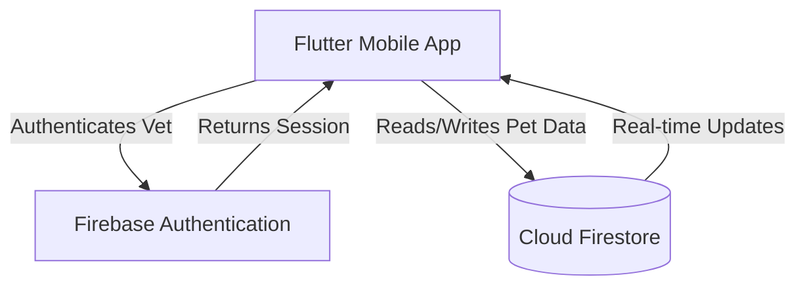

# High-Level Design (HLD) - VetRecords

## 1. Introduction
This document provides the high-level architecture and design for the VetRecords mobile application. VetRecords is a cross-branch pet medical record platform built using Flutter and Firebase, designed to centralize veterinary records and improve the visibility of pet medical histories across multiple clinic branches.

## 2. System Architecture
VetRecords follows a standard 2-tier client-server architecture using Firebase as a backend-as-a-service (BaaS).

- **Client Tier:** Flutter mobile application (Android/iOS). Handles UI, local state management, and user interactions.
- **Data Tier:** Firebase Services (Authentication, Firestore Database). Handles identity, persistence, and real-time data synchronization.

### 2.1 Architecture Diagram

## 3. Data Flow
1. **Authentication:** The Vet logs in via Firebase Authentication using email and password.
2. **Search:** The App sends a query to Firestore to find a pet by name, owner, or ID.
3. **Retrieval:** Firestore returns the matching pet documents.
4. **Detail View:** When a pet is selected, the app subscribes to a real-time stream of the `visits` collection for that specific `petId`.
5. **Data Creation:** When a Vet adds a new visit, the app writes a new document to the `visits` collection, appending the `branchId` and `vetId`.
6. **Sync:** Since the app is listening to the `visits` stream, the new visit is immediately reflected on all connected clients.

## 4. Technology Stack
- **Frontend:** Flutter (Dart)
- **Backend & Database:** Firebase Cloud Firestore (NoSQL)
- **Authentication:** Firebase Authentication

## 5. Database Schema (Firestore)
The database relies on a NoSQL document model.

- **`pets` Collection:** Core pet information.
  - `petId` (String), `name` (String), `species` (String), `breed` (String), `ownerName` (String), `dob` (Timestamp)
- **`visits` Collection:** Medical history and visit logs.
  - `visitId` (String), `petId` (String), `branchId` (String), `vetId` (String), `date` (Timestamp), `notes` (String), `medications` (Array of Strings), `vaccination` (String), `nextFollowUpDate` (Timestamp)
- **`branches` Collection:** Clinic locations.
  - `branchId` (String), `name` (String), `location` (String)
- **`vets` Collection:** Veterinarian details.
  - `vetId` (String), `name` (String), `branchId` (String)

## 6. Security & Access Control
- **Authentication:** Only authenticated veterinarians can access the system.
- **Firestore Security Rules:** 
  - Read access is allowed for all authenticated vets.
  - Write access is restricted; vets can only create visit records tied to their own `vetId`.
- **Session Management:** Handled natively by Firebase Auth persistent sessions.

## 7. Key UI Components & State Management
- **Auth Service:** Manages login state and user session persistence.
- **Search Controller:** Handles query execution and state for the pet search functionality across all branches.
- **Visit StreamBuilder:** Listens to real-time `visits` updates for a specific pet to ensure chronological display without manual refresh.
- **Alert/Flagging Utility:** A local utility that processes the visit stream to check `medications` and `nextFollowUpDate` against the current date, triggering UI warnings for overdue follow-ups or recent duplicate medications.
