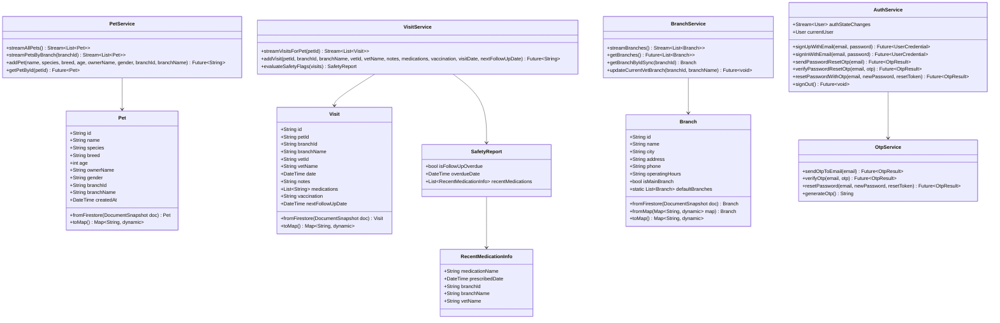

# 🔍 Low-Level Design (LLD) — VetSync

**System:** VetSync Centralized Veterinary Health-Record Platform  
**Document Version:** 2.0  
**Language / Framework:** Dart 3.12.2 / Flutter 3.44.9  
**Target:** Engineering, Architecture & Review Teams  

---

## 1. Class Diagram & Architecture



---

## 2. Detailed Data Models

### 2.1 `Pet` Model (`lib/models/pet.dart`)
```dart
class Pet {
  final String id;
  final String name;
  final String species;
  final String breed;
  final int age;
  final String ownerName;
  final String gender;
  final String branchId;
  final String branchName;
  final DateTime? createdAt;

  const Pet({
    required this.id,
    required this.name,
    required this.species,
    required this.breed,
    required this.age,
    required this.ownerName,
    this.gender = 'Unknown',
    this.branchId = 'BRANCH_DELHI',
    this.branchName = 'Delhi Central Clinic',
    this.createdAt,
  });

  factory Pet.fromFirestore(DocumentSnapshot doc);
  Map<String, dynamic> toMap();
}
```

### 2.2 `Visit` Model (`lib/models/visit.dart`)
```dart
class Visit {
  final String id;
  final String petId;
  final String branchId;
  final String branchName;
  final String vetId;
  final String vetName;
  final DateTime date;
  final String notes;
  final List<String> medications;
  final String vaccination;
  final DateTime? nextFollowUpDate;

  const Visit({
    required this.id,
    required this.petId,
    required this.branchId,
    this.branchName = '',
    required this.vetId,
    required this.vetName,
    required this.date,
    required this.notes,
    required this.medications,
    this.vaccination = '',
    this.nextFollowUpDate,
  });

  factory Visit.fromFirestore(DocumentSnapshot doc);
  Map<String, dynamic> toMap();
}
```

### 2.3 `Branch` Model (`lib/models/branch.dart`)
```dart
class Branch {
  final String id;
  final String name;
  final String city;
  final String address;
  final String phone;
  final String operatingHours;
  final bool isMainBranch;

  static const List<Branch> defaultBranches = [...]; // 7 Regional Clinics
}
```

---

## 3. Services API Specification

### 3.1 `VisitService.evaluateSafetyFlags(List<Visit> visits)`
```dart
SafetyReport evaluateSafetyFlags(List<Visit> visits) {
  if (visits.isEmpty) {
    return const SafetyReport(isFollowUpOverdue: false, recentMedications: []);
  }

  final now = DateTime.now();
  bool isOverdue = false;
  DateTime? overdueDate;

  // Ensure visits are sorted chronologically descending (newest visit first)
  final sortedVisits = List<Visit>.from(visits)
    ..sort((a, b) => b.date.compareTo(a.date));

  // Check only the most recent visit that scheduled a follow-up
  for (final visit in sortedVisits) {
    if (visit.nextFollowUpDate != null) {
      if (visit.nextFollowUpDate!.isBefore(now)) {
        // Verify whether subsequent visits have occurred since that follow-up date
        final hasSubsequentVisit = sortedVisits.any(
          (v) =>
              v.date.isAfter(visit.date) &&
              _isSameDayOrAfter(v.date, visit.nextFollowUpDate!),
        );

        if (!hasSubsequentVisit) {
          isOverdue = true;
          overdueDate = visit.nextFollowUpDate;
        }
      }
      break;
    }
  }

  final fourteenDaysAgo = now.subtract(const Duration(days: 14));
  final List<RecentMedicationInfo> recentMeds = [];

  for (final visit in visits) {
    if (visit.date.isAfter(fourteenDaysAgo)) {
      for (final med in visit.medications) {
        if (med.trim().isNotEmpty) {
          recentMeds.add(RecentMedicationInfo(
            medicationName: med.trim(),
            prescribedDate: visit.date,
            branchId: visit.branchId,
            branchName: visit.branchName,
            vetName: visit.vetName,
          ));
        }
      }
    }
  }

  return SafetyReport(
    isFollowUpOverdue: isOverdue,
    overdueDate: overdueDate,
    recentMedications: recentMeds,
  );
}
```

### 3.2 `OtpService`
- **`sendOtpToEmail(String email)`**: Generates 6-digit code, saves in-memory with 10-minute expiration, sends via Brevo HTTP POST.
- **`verifyOtp(String email, String otp)`**: Validates user PIN, generates 15-minute reset token.
- **`resetPassword(String email, String newPassword, String resetToken)`**: Updates password securely and invalidates session token.

---

## 4. UI Screen Hierarchy

```
MaterialApp
 └── AuthWrapper (StreamBuilder<User?>)
      ├── Unauthenticated: LoginScreen
      │    ├── SignupScreen
      │    └── ForgotPasswordScreen (3-step OTP Flow)
      └── Authenticated: MainNavigationScreen (4-Tab IndexedStack)
           ├── Tab 0: HomeScreen (Metrics & Recent Cross-Branch Activity)
           ├── Tab 1: PetsScreen (Patient Directory & Branch Chips)
           ├── Tab 2: AlertsScreen (Safety Flags & Overdue Follow-ups)
           └── Tab 3: ProfileScreen (Doctor Station & Logout)
```

---

## 5. Test Suite Specification

| Test File | Target | Coverage |
| :--- | :--- | :--- |
| `otp_service_test.dart` | `OtpService` | PIN format, verification failures, expiration |
| `widget_test.dart` | `Branch`, `Pet`, `Visit` | Serialization, branch retention, metadata |
| `widget_test.dart` | `BranchSelectionScreen` | Search filtering, city filter chips |
| `widget_test.dart` | `ForgotPasswordScreen` | Email step, OTP input rendering |
